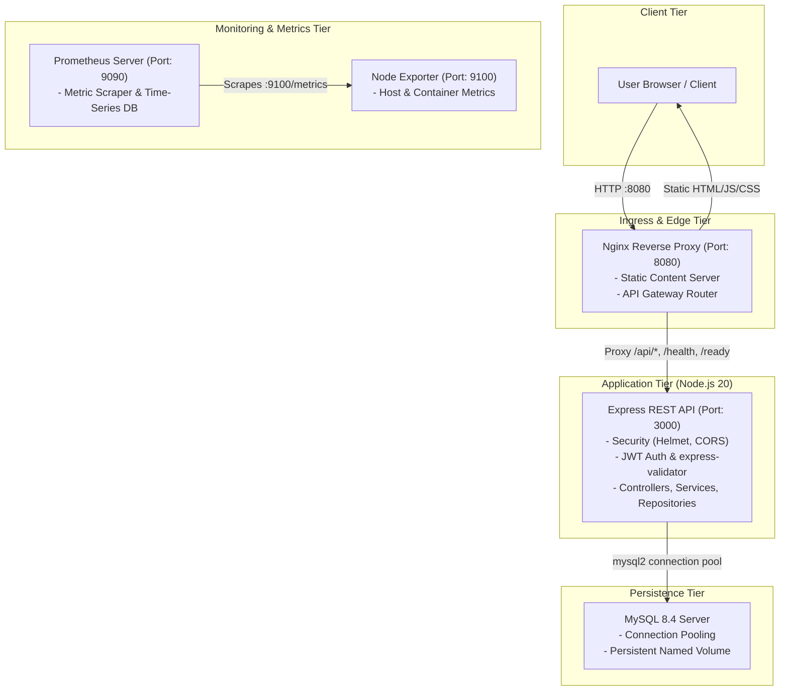
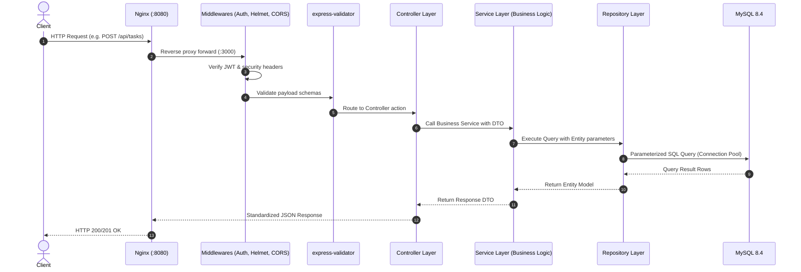
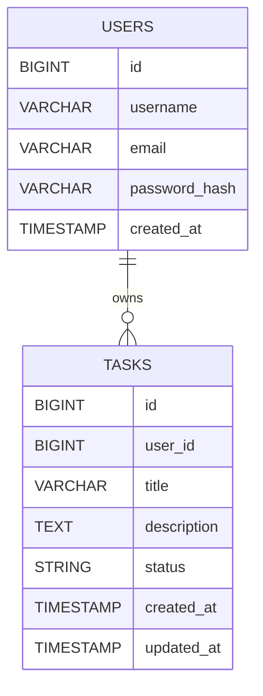
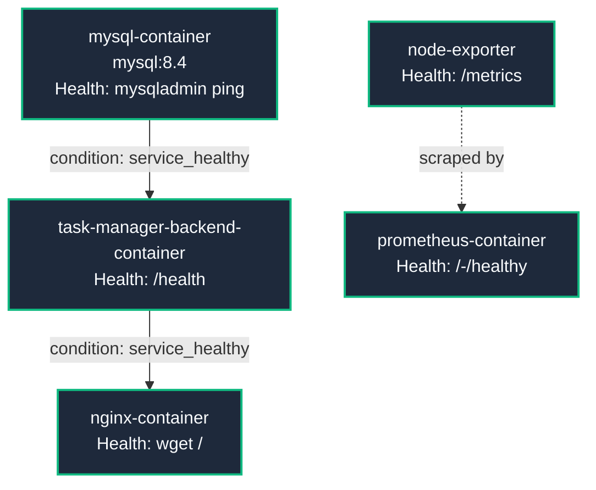

# DevOps Task Manager

[](https://nodejs.org)
[](https://expressjs.com/)
[](https://www.mysql.com/)
[](https://www.docker.com/)
[](https://nginx.org/)
[](https://prometheus.io/)
[](https://opensource.org/licenses/ISC)

A production-ready, full-stack Task Management application architected according to modern DevOps best practices. The project features a robust **Layered (N-Tier) Node.js/Express REST API**, a high-performance **Nginx Reverse Proxy**, relational **MySQL 8.4** persistence, end-to-end container health monitoring with **Docker Compose**, and infrastructure observability powered by **Prometheus & Node Exporter**.

---

## 📑 Table of Contents

- [Architectural Overview](#-architectural-overview)
- [Key Features](#-key-features)
- [Technology Stack](#-technology-stack)
- [Project Directory Structure](#-project-directory-structure)
- [Database Schema & Data Model](#-database-schema--data-model)
- [Environment Variables](#-environment-variables)
- [Quick Start Guide](#-quick-start-guide)
  - [Prerequisites](#prerequisites)
  - [Method 1: Running with Docker Compose (Recommended)](#method-1-running-with-docker-compose-recommended)
  - [Method 2: Local Development (Bare Metal)](#method-2-local-development-bare-metal)
- [API Documentation](#-api-documentation)
  - [Health & Readiness Endpoints](#health--readiness-endpoints)
  - [Authentication Endpoints](#authentication-endpoints)
  - [Task Management Endpoints](#task-management-endpoints)
- [DevOps, Containerization & Healthchecks](#-devops-containerization--healthchecks)
- [Monitoring & Observability](#-monitoring--observability)
- [Security Implementations](#-security-implementations)
- [Troubleshooting & FAQ](#-troubleshooting--faq)
- [License](#-license)

---

## 🏛 Architectural Overview

The application follows an **N-Tier Layered Architecture** with strict separation of concerns, containerized into independent, cooperative micro-services managed through Docker Compose.



### Backend Request Lifecycle



---

## ✨ Key Features

- **Full CRUD Task Management**: Seamlessly create, read, update status (`TODO`, `IN_PROGRESS`, `DONE`), edit descriptions, and delete tasks.
- **Stateless JWT Authentication**: Secure user registration, authentication, and session handling using JSON Web Tokens and bcrypt (12 salt rounds).
- **Domain-Driven Layering**: Clean separation across **Entities**, **DTOs** (Data Transfer Objects), **Repositories**, **Services**, and **Controllers**.
- **Input Validation & Sanitization**: Comprehensive input validation and sanitization using `express-validator`.
- **Centralized Error Handling**: Standardized JSON responses for all domain errors, validation errors, and uncaught exceptions.
- **Enterprise Edge Proxying**: Nginx acts as an ingress reverse proxy, serving the frontend Single-Page Application and routing API requests to the backend.
- **Proactive Health Probes**:
  - `/health`: Liveness probe for process uptime.
  - `/ready`: Readiness probe verifying live MySQL connection status (`SELECT 1`).
- **Container Dependency Orchestration**: Healthcheck-driven boot sequence ensuring MySQL initializes before the Backend, and the Backend is healthy before Nginx accepts traffic.
- **Infrastructure Observability**: Prometheus scraping infrastructure metrics via Node Exporter on a 15-second scrape interval.
- **Security Hardened**: Helmet HTTP security headers, tailored Content Security Policy (CSP), CORS configuration, and non-root execution inside Docker (`USER node`).

---

## 🛠 Technology Stack

| Layer | Technology | Details |
| :--- | :--- | :--- |
| **Frontend** | Vanilla JavaScript (ES6+), HTML5, Modern CSS3 | Responsive dark-mode glassmorphic interface, client-side API engine |
| **Runtime & Framework** | Node.js (v20 Alpine), Express.js (v4.19) | Asynchronous I/O, RESTful JSON API |
| **Database** | MySQL 8.4 LTS | Relational storage, Foreign Key cascades, indexing, connection pooling (`mysql2`) |
| **Authentication & Security** | JWT (`jsonwebtoken`), `bcryptjs`, `helmet` | Salted password hashing (rounds: 12), token verification, security headers |
| **Validation** | `express-validator` | Strict request parameter, body, and query validation |
| **Reverse Proxy** | Nginx (Alpine) | Routing, static file hosting, upstream load balancing |
| **Containerization** | Docker, Docker Compose | Multi-container setup, custom bridge network, named volumes |
| **Monitoring** | Prometheus, Prometheus Node Exporter | Metric collection, health status inspection, system time-series |

---

## 📂 Project Directory Structure

```text
devops-task-manager/
├── .dockerignore                 # Excluded files during Docker build
├── .env.example                  # Template for environment configuration
├── .gitignore                    # Git tracking ignore rules
├── Dockerfile                    # Multi-stage-ready Node 20 Alpine backend image
├── docker-compose.yaml           # Multi-service container orchestration
├── package.json                  # Node.js project manifest & dependencies
├── nginx/
│   └── default.conf              # Nginx reverse proxy & static routing rules
├── prometheus/
│   └── prometheus.yml            # Prometheus scrape configurations & targets
├── frontend/                     # Client application UI & static assets
│   ├── index.html                # Client root & session router
│   ├── css/
│   │   └── styles.css            # Dark-mode glassmorphism styling
│   ├── js/
│   │   ├── api.js                # Reusable HTTP client with JWT interceptor
│   │   ├── auth.js               # Client auth logic (register/login handlers)
│   │   └── dashboard.js          # Task board operations, modals & UI state
│   └── pages/
│       ├── dashboard.html        # Main authenticated task manager UI
│       ├── login.html            # User login page
│       └── register.html         # User registration page
└── src/                          # Backend source code (Layered Architecture)
    ├── app.js                    # Express application setup, security, routes & middleware
    ├── server.js                 # Entry point, database verification & process handlers
    ├── config/
    │   ├── database.js           # MySQL2 connection pool & connection tester
    │   └── env.js                # Centralized environment variable parser
    ├── controllers/
    │   ├── authController.js     # User registration, login, and logout handlers
    │   ├── healthController.js   # Health and readiness check handlers
    │   └── taskController.js     # Task CRUD request handling
    ├── database/
    │   └── schema.sql            # DDL for database, tables, and indices
    ├── dtos/                     # Data Transfer Objects
    │   ├── CreateTaskRequestDto.js
    │   ├── CreateUserRequestDto.js
    │   ├── LoginRequestDto.js
    │   ├── TaskResponseDto.js
    │   ├── UpdateTaskRequestDto.js
    │   └── UserResponseDto.js
    ├── entities/                 # Data model domain entities
    │   ├── Task.js
    │   └── User.js
    ├── exceptions/               # Custom typed exceptions
    │   ├── AppError.js           # Base application error
    │   ├── BadRequestError.js    # HTTP 400
    │   ├── ForbiddenError.js     # HTTP 403
    │   ├── NotFoundError.js      # HTTP 404
    │   ├── UnauthorizedError.js  # HTTP 401
    │   └── ValidationError.js   # HTTP 422 / 400
    ├── middlewares/
    │   ├── authMiddleware.js     # JWT extraction, verification & user context injection
    │   └── errorHandler.js       # Global exception catch-all & JSON formatter
    ├── repositories/             # Data Access Layer (SQL queries via connection pool)
    │   ├── healthRepository.js   # Database ping query execution
    │   ├── taskRepository.js     # Task queries (CRUD, user isolation)
    │   └── userRepository.js     # User lookups & user creation
    ├── routes/
    │   ├── authRoutes.js         # Routes for /api/auth
    │   ├── healthRoutes.js       # Routes for /health and /ready
    │   ├── index.js              # Central API router aggregator
    │   └── taskRoutes.js         # Routes for /api/tasks
    ├── utils/
    │   └── jwtHelper.js          # JWT sign and verify helpers
    └── validators/
        ├── authValidator.js      # Register & login validation rules
        ├── taskValidator.js      # Create, update, and id validation rules
        └── validate.js           # Validation result middleware
```

---

## 🗄 Database Schema & Data Model

The application uses **MySQL 8.4** (`devops_tm` database). Referential integrity and performance are preserved through foreign keys with `ON DELETE CASCADE` and targeted indices.



### Constraints

#### USERS
- `id` → Primary Key, AUTO_INCREMENT
- `username` → UNIQUE
- `email` → UNIQUE, INDEXED

#### TASKS
- `id` → Primary Key, AUTO_INCREMENT
- `user_id` → Foreign Key → `USERS(id)`
- `ON DELETE CASCADE`
- `status` → `TODO`, `IN_PROGRESS`, `DONE`

### Table Definitions

1. **`users`**
   - `id`: Primary Key, auto-incrementing integer.
   - `username`: Unique username (3–100 alphanumeric characters).
   - `email`: Unique, validated email address (Indexed: `idx_users_email`).
   - `password_hash`: Salted Bcrypt hash string.
   - `created_at`: Creation timestamp.

2. **`tasks`**
   - `id`: Primary Key, auto-incrementing integer.
   - `user_id`: Foreign key linked to `users.id` with cascade deletion (Indexed: `idx_tasks_user_id`).
   - `title`: Task title (up to 255 characters).
   - `description`: Optional extended task description (up to 2000 characters).
   - `status`: Enumerated state (`TODO`, `IN_PROGRESS`, `DONE`) (Indexed: `idx_tasks_status`).
   - `created_at` & `updated_at`: Auditing timestamps.

---

## ⚙️ Environment Variables

Copy the provided template to configure your environment:

```bash
cp .env.example .env
```

| Variable | Description | Default (Local) | Default (Docker) | Required |
| :--- | :--- | :--- | :--- | :---: |
| `PORT` | Node.js backend port | `3000` | `3000` | No |
| `NODE_ENV` | Application runtime environment | `development` | `production` | No |
| `DB_HOST` | MySQL hostname or container name | `localhost` | `mysql-container` | **Yes** |
| `DB_PORT` | MySQL connection port | `3306` | `3306` | No |
| `DB_USER` | MySQL database user | `root` | `task_user` | **Yes** |
| `DB_PASSWORD` | MySQL database user password | `your_password` | `task_password` | **Yes** |
| `DB_NAME` | MySQL database name | `devops_tm` | `devops_tm` | **Yes** |
| `ROOT_PASSWRD` | MySQL root administrative password | - | `root_password` | **Yes (Compose)** |
| `JWT_SECRET` | Secret key used to sign and verify JWTs | *Random Secret* | *Change in production* | **Yes** |
| `JWT_EXPIRES_IN` | Token expiration lifespan | `24h` | `24h` | No |
| `CORS_ALLOWED_ORIGINS` | Comma-separated list of allowed origins | `http://localhost:3000` | `http://localhost:8080` | No |

---

## 🚀 Quick Start Guide

### Prerequisites

- [Docker](https://docs.docker.com/get-docker/) (v24.0+) & [Docker Compose](https://docs.docker.com/compose/) (v2.20+)
- *For bare-metal local development:* [Node.js](https://nodejs.org/) (v20.x+) and [MySQL](https://dev.mysql.com/) (v8.0+)

---

### Method 1: Running with Docker Compose (Recommended)

1. **Clone the Repository**:
   ```bash
   git clone git@github.com:hilalinabil/devops-task-manager.git
   cd devops-task-manager
   ```

2. **Configure Environment Variables**:
   ```bash
   cp .env.example .env
   ```

3. **Launch the Container Stack**:
   ```bash
   docker compose up --build -d
   ```

4. **Verify Container Health & Status**:
   ```bash
   docker compose ps
   ```
   You should see all 5 containers in a healthy/running state:
   - `nginx-container` (Healthy, port `8080`)
   - `task-manager-backend-container` (Healthy, port `3000`)
   - `mysql-container` (Healthy, port `3306`)
   - `prometheus-container` (Healthy, port `9090`)
   - `node-exporter` (Healthy, port `9100`)

5. **Initialize Database Schema (First-Time Run)**:
   Import the schema into the running MySQL container:
   ```bash
   docker exec -i mysql-container mysql -u root -p$(grep ROOT_PASSWRD .env | cut -d '=' -f2) devops_tm < src/database/schema.sql
   ```

6. **Access the Application Services**:
   - 🌐 **Web UI / Task Dashboard**: [http://localhost:8080](http://localhost:8080)
   - 🔌 **API Base URL**: [http://localhost:8080/api](http://localhost:8080/api)
   - 🩺 **Health Check**: [http://localhost:8080/health](http://localhost:8080/health)
   - 📊 **Prometheus Web UI**: [http://localhost:9090](http://localhost:9090)
   - 📈 **Node Exporter Metrics**: [http://localhost:9100/metrics](http://localhost:9100/metrics)

7. **Stop the Containers**:
   ```bash
   docker compose down
   # To remove volumes as well:
   docker compose down -v
   ```

---

### Method 2: Local Development (Bare Metal)

1. **Install Node.js Dependencies**:
   ```bash
   npm install
   ```

2. **Setup Local Database**:
   Make sure MySQL is running locally, then initialize the database:
   ```bash
   mysql -u root -p < src/database/schema.sql
   ```

3. **Configure Local Environment**:
   Edit your `.env` file to point to your local MySQL instance:
   ```env
   PORT=3000
   NODE_ENV=development
   DB_HOST=localhost
   DB_PORT=3306
   DB_USER=root
   DB_PASSWORD=your_local_password
   DB_NAME=devops_tm
   JWT_SECRET=local_development_secret_key_12345
   JWT_EXPIRES_IN=24h
   ```

4. **Run the Application**:
   ```bash
   # Development mode with hot-reloading (nodemon)
   npm run dev

   # Production mode
   npm start
   ```

5. **Open in Browser**:
   Open [http://localhost:3000](http://localhost:3000) in your web browser.

---

## 📡 API Documentation

### Health & Readiness Endpoints

#### 1. Liveness Check
Checks whether the Express service is responsive.
- **URL**: `GET /health`
- **Auth Required**: No
- **Response `200 OK`**:
  ```json
  {
    "status": "UP",
    "service": "task-manager-api",
    "timestamp": "2026-09-30T13:30:00.000Z"
  }
  ```

#### 2. Readiness Check
Checks whether the backend can query the MySQL database.
- **URL**: `GET /ready`
- **Auth Required**: No
- **Response `200 OK` (Healthy)**:
  ```json
  {
    "application": "UP",
    "database": "UP",
    "timestamp": "2026-09-30T13:30:00.000Z"
  }
  ```
- **Response `503 Service Unavailable` (Database Down)**:
  ```json
  {
    "application": "UP",
    "database": "DOWN",
    "timestamp": "2026-09-30T13:30:00.000Z"
  }
  ```

---

### Authentication Endpoints

#### 1. Register User
- **URL**: `POST /api/auth/register`
- **Auth Required**: No
- **Request Body**:
  ```json
  {
    "username": "johndoe",
    "email": "john@example.com",
    "password": "Password123"
  }
  ```
- **Response `201 Created`**:
  ```json
  {
    "success": true,
    "message": "User registered successfully",
    "data": {
      "id": 1,
      "username": "johndoe",
      "email": "john@example.com",
      "createdAt": "2026-09-30T13:30:00.000Z"
    }
  }
  ```

#### 2. User Login
- **URL**: `POST /api/auth/login`
- **Auth Required**: No
- **Request Body**:
  ```json
  {
    "email": "john@example.com",
    "password": "Password123"
  }
  ```
- **Response `200 OK`**:
  ```json
  {
    "success": true,
    "message": "Login successful",
    "token": "eyJhbGciOiJIUzI1NiIsInR5cCI6IkpXVCJ9...",
    "data": {
      "id": 1,
      "username": "johndoe",
      "email": "john@example.com",
      "createdAt": "2026-09-30T13:30:00.000Z"
    }
  }
  ```

#### 3. User Logout
- **URL**: `POST /api/auth/logout`
- **Auth Required**: No
- **Response `200 OK`**:
  ```json
  {
    "success": true,
    "message": "Logout successful"
  }
  ```

---

### Task Management Endpoints

> **Note**: All task endpoints require the HTTP Header:  
> `Authorization: Bearer <your_jwt_token>`

#### 1. Create a Task
- **URL**: `POST /api/tasks`
- **Request Body**:
  ```json
  {
    "title": "Set up CI/CD Pipeline",
    "description": "Configure GitHub Actions workflow for automated testing and image build",
    "status": "TODO"
  }
  ```
  *(Status is optional and defaults to `TODO`. Allowed values: `TODO`, `IN_PROGRESS`, `DONE`)*
- **Response `201 Created`**:
  ```json
  {
    "success": true,
    "message": "Task created successfully",
    "data": {
      "id": 1,
      "userId": 1,
      "title": "Set up CI/CD Pipeline",
      "description": "Configure GitHub Actions workflow for automated testing and image build",
      "status": "TODO",
      "createdAt": "2026-09-30T13:30:00.000Z",
      "updatedAt": "2026-09-30T13:30:00.000Z"
    }
  }
  ```

#### 2. Get All Tasks
- **URL**: `GET /api/tasks`
- **Optional Query Parameter**: `?status=IN_PROGRESS` (filter by status)
- **Response `200 OK`**:
  ```json
  {
    "success": true,
    "data": [
      {
        "id": 1,
        "userId": 1,
        "title": "Set up CI/CD Pipeline",
        "description": "Configure GitHub Actions workflow for automated testing and image build",
        "status": "TODO",
        "createdAt": "2026-09-30T13:30:00.000Z",
        "updatedAt": "2026-09-30T13:30:00.000Z"
      }
    ]
  }
  ```

#### 3. Get Task By ID
- **URL**: `GET /api/tasks/:id`
- **Response `200 OK`**:
  ```json
  {
    "success": true,
    "data": {
      "id": 1,
      "userId": 1,
      "title": "Set up CI/CD Pipeline",
      "description": "Configure GitHub Actions workflow for automated testing and image build",
      "status": "TODO",
      "createdAt": "2026-09-30T13:30:00.000Z",
      "updatedAt": "2026-09-30T13:30:00.000Z"
    }
  }
  ```

#### 4. Update Task
- **URL**: `PUT /api/tasks/:id`
- **Request Body**:
  ```json
  {
    "title": "Set up CI/CD Pipeline",
    "description": "GitHub Actions workflow running and passing",
    "status": "IN_PROGRESS"
  }
  ```
- **Response `200 OK`**:
  ```json
  {
    "success": true,
    "message": "Task updated successfully",
    "data": {
      "id": 1,
      "userId": 1,
      "title": "Set up CI/CD Pipeline",
      "description": "GitHub Actions workflow running and passing",
      "status": "IN_PROGRESS",
      "createdAt": "2026-09-30T13:30:00.000Z",
      "updatedAt": "2026-09-30T13:35:00.000Z"
    }
  }
  ```

#### 5. Delete Task
- **URL**: `DELETE /api/tasks/:id`
- **Response `200 OK`**:
  ```json
  {
    "success": true,
    "message": "Task deleted successfully"
  }
  ```

---

### Standardized Error Format

Whenever a client or server error occurs, the API returns a structured JSON payload:

```json
{
  "success": false,
  "message": "Validation failed",
  "timestamp": "2026-09-30T13:30:00.000Z",
  "path": "/api/auth/register",
  "errors": [
    {
      "field": "email",
      "message": "Please enter a valid email address"
    }
  ]
}
```

---

## 🐳 DevOps, Containerization & Healthchecks

### Dockerfile Specifications
The backend uses a security-hardened `node:20-alpine` image:
- Runs `npm ci` for fast, reproducible, and locked dependency installs.
- Enforces non-root user execution: `chown -R node:node /app` and `USER node`.
- Integrates a native container-level healthcheck:
  ```dockerfile
  HEALTHCHECK --interval=30s --timeout=5s --retries=3 \
      CMD wget --spider -q http://localhost:3000/health || exit 1
  ```

### Docker Compose Services & Dependency Graph



1. **`mysql`**:
   - Runs `mysqladmin ping -h localhost` healthcheck (every 10s).
   - Data persists across container teardowns via the named volume `mysql-task-data`.
2. **`backend`**:
   - Won't start until MySQL satisfies `service_healthy`.
   - Probes `http://localhost:3000/health` before passing health validation.
3. **`nginx`**:
   - Reverse proxies frontend and API traffic.
   - Waits for the backend to be `service_healthy` before exposing port `8080`.
4. **`node-exporter`**:
   - Collects host metrics on port `9100`.
5. **`promethues`**:
   - Pulls metrics every 15s from `node-exporter:9100` and serves the dashboard on port `9090`.

---

## 📊 Monitoring & Observability

### Prometheus Configuration (`prometheus/prometheus.yml`)
Prometheus collects system performance metrics automatically on startup:

```yaml
global:
  scrape_interval: 15s

scrape_configs:
  - job_name: node-exporter
    static_configs:
      - targets:
          - node-exporter:9100
```

### Useful Prometheus Queries
Navigate to [http://localhost:9090/graph](http://localhost:9090/graph) and test the following PromQL expressions:

- **CPU Usage Breakdown**:
  ```promql
  sum by (mode) (rate(node_cpu_seconds_total[1m]))
  ```
- **Memory Consumption**:
  ```promql
  node_memory_MemTotal_bytes - node_memory_MemAvailable_bytes
  ```
- **Network Traffic Received**:
  ```promql
  rate(node_network_receive_bytes_total[1m])
  ```
- **Disk Write Rates**:
  ```promql
  rate(node_disk_written_bytes_total[1m])
  ```

---

## 🔒 Security Implementations

- **Parameterized SQL Queries**: All queries in `taskRepository` and `userRepository` use prepared statements (`pool.execute(query, params)`) to eliminate SQL Injection vectors.
- **Cryptographic Password Hashing**: Passwords are never stored in plaintext; salted with 12 rounds of `bcryptjs`.
- **Stateless Authorization**: JWT signatures are validated per request; tokens include user ID context while avoiding storage of sensitive data in claims.
- **User Resource Isolation**: Every database interaction verifying a task automatically validates `WHERE user_id = ?`, ensuring users cannot inspect or manipulate other users' tasks (IDOR prevention).
- **HTTP Security Headers (`helmet`)**: Configured with strict Content Security Policy directives restricting script sources, style sources, and font providers.
- **Non-Root Execution**: Docker container drops root privileges to `USER node` to prevent container-breakout escalation.
- **Strict Data Validation**: Request parameters, numbers, and strings are checked through type and length constraints using `express-validator`.

---

## ❓ Troubleshooting & FAQ

<details>
<summary><strong>1. Database connection fails during first-time startup</strong></summary>

MySQL might take a few seconds to initialize its data directory on a fresh volume. The backend container automatically waits for MySQL's healthcheck (`service_healthy`). If you see a connection error, verify that your credentials in `.env` match:
```bash
docker compose logs mysql
docker compose logs backend
```
</details>

<details>
<summary><strong>2. Port 8080, 3000, 9090, or 9100 is already in use</strong></summary>

If another service occupies any of these ports, adjust the host port mapping in `docker-compose.yaml`. For example, change:
```yaml
ports:
  - "8081:80" # Instead of 8080:80
```
Then access the dashboard at `http://localhost:8081`.
</details>

<details>
<summary><strong>3. How to reset the database and volume</strong></summary>

To purge all tasks, users, and database state for a fresh start:
```bash
docker compose down -v
docker compose up --build -d
```
Then re-import `schema.sql` as shown in the [Quick Start Guide](#method-1-running-with-docker-compose-recommended).
</details>

---

## 📄 License

This project is licensed under the [ISC License](https://opensource.org/licenses/ISC).
